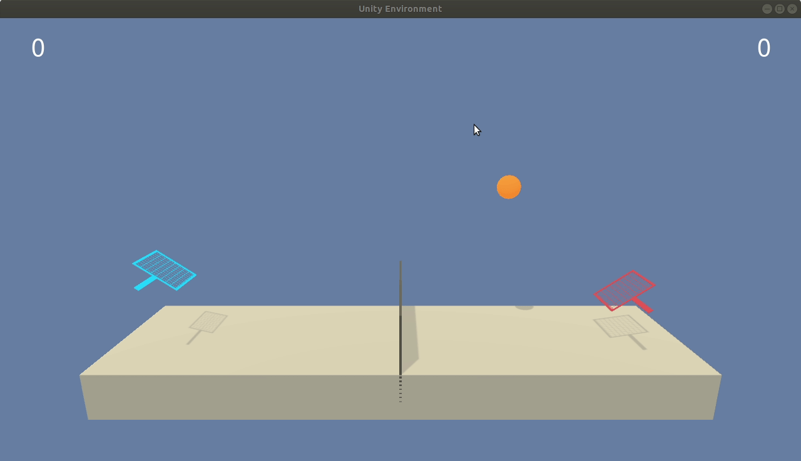

[//]: # (Image References)

[image1]: https://user-images.githubusercontent.com/10624937/43851024-320ba930-9aff-11e8-8493-ee547c6af349.gif "Trained Agent"
[image2]: https://user-images.githubusercontent.com/10624937/43851646-d899bf20-9b00-11e8-858c-29b5c2c94ccc.png "Crawler"

# Reacher - Continuous Control

### Introduction

This repo trains a DDPG agent to solve the Unity [Reacher](https://github.com/Unity-Technologies/ml-agents/blob/master/docs/Learning-Environment-Examples.md#reacher) environment.

![Trained Agent][image1]

In this environment, a double-jointed arm can move to target locations. A reward of +0.1 is provided for each step that the agent's hand is in the goal location. Thus, the goal of the agent is to maintain its position at the target location for as many time steps as possible.

The observation space consists of 33 variables corresponding to position, rotation, velocity, and angular velocities of the arm. Each action is a vector with four numbers, corresponding to torque applicable to two joints. Every entry in the action vector should be a number between -1 and 1.

### Getting Started

1. Clone this repo.
2. Install the python dependencies by running `pip install -r requirements.txt`
3. Download the Unity environment matching your OS to the root folder of the repo and unzip the file.

    - **_Version 2: Twenty (20) Agents_**
        - Linux: [click here](https://s3-us-west-1.amazonaws.com/udacity-drlnd/P2/Reacher/Reacher_Linux.zip)
        - Mac OSX: [click here](https://s3-us-west-1.amazonaws.com/udacity-drlnd/P2/Reacher/Reacher.app.zip)
        - Windows (32-bit): [click here](https://s3-us-west-1.amazonaws.com/udacity-drlnd/P2/Reacher/Reacher_Windows_x86.zip)
        - Windows (64-bit): [click here](https://s3-us-west-1.amazonaws.com/udacity-drlnd/P2/Reacher/Reacher_Windows_x86_64.zip)

### Further Instructions

- Further project description: algorithm description, result presentation can be find in [Report_DDPG](Report_DDPG.md).
- Environment handing can be find in [Continuous_Control.py](Continuous_Control.py) in `ddpg` function.
- Agent learning algorithm can be find in [ddpg_agent.py](ddpg_agent.py) in `myDDPG` class.

# Project: Tennis (Collaboration and Competition)

## Project Details

In this project, we will work with a Collaboration and Competition environment, Tennis.

In this environment, two agents control rackets to bounce a ball over a net. If an agent hits the ball over the net, it receives a reward of +0.1.  If an agent lets a ball hit the ground or hits the ball out of bounds, it receives a reward of -0.01.  Thus, the goal of each agent is to keep the ball in play.

The observation space consists of 8 variables corresponding to the position and velocity of the ball and racket. Each agent receives its own, local observation.  Two continuous actions are available, corresponding to movement toward (or away from) the net, and jumping. 

The task is episodic, and in order to solve the environment, the agents must get an average score of +0.5 (over 100 consecutive episodes, after taking the maximum over both agents). Specifically,

- After each episode, we add up the rewards that each agent received (without discounting), to get a score for each agent. This yields 2 (potentially different) scores. We then take the maximum of these 2 scores.
- This yields a single **score** for each episode.

The environment is considered solved, when the average (over 100 episodes) of those **scores** is at least +0.5.

## Getting Started

### Unity Environment

For this project, we can download it from one of the links below. You need only select the environment that matches the operating system:

- Linux: [click here](https://s3-us-west-1.amazonaws.com/udacity-drlnd/P3/Tennis/Tennis_Linux.zip)
- Mac OSX: [click here](https://s3-us-west-1.amazonaws.com/udacity-drlnd/P3/Tennis/Tennis.app.zip)
- Windows (32-bit): [click here](https://s3-us-west-1.amazonaws.com/udacity-drlnd/P3/Tennis/Tennis_Windows_x86.zip)
- Windows (64-bit): [click here](https://s3-us-west-1.amazonaws.com/udacity-drlnd/P3/Tennis/Tennis_Windows_x86_64.zip)

Then, place the file in the `Tennis_using_MADDPG/data/` folder, and unzip (or decompress) the file.

__This repo is built in Ubuntu, please change the environment file if your OS is different.__

### Required Python Packages

To install required packages, run `pip install -r src/requirements.txt` in terminal.

## Further Instructions

- Further project description: algorithm description, result presentation can be find in [Report_MADDPG.md](Report_MADDPG.md).
- Environment handing can be find in [Continuous_Control.py](Continuous_Control.py) in `maddpg` function.
- Agent learning algorithm can be find in [ddpg_agent.py](ddpg_agent.py) in `myMADDPG` class.

