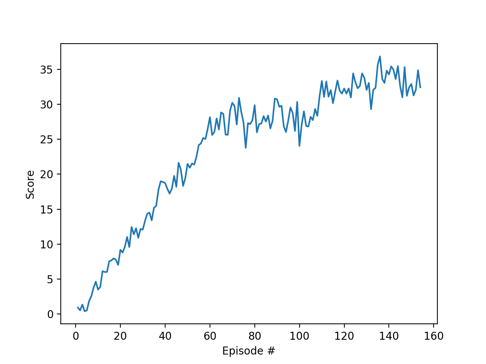

# Environment 

Reacher environment is playground provided by Unity for machine learning challenges. In the simulation an agent is a robot arm with 2 joints and 2 links. It can be controlled by 4 continuous space variables which represents torque on both joints. As an control input we get a vector with 33 variables which represents state of the are and position of the target.

## Learning Algorithm

To solve Reacher environment I decided to use ddpg algorithm from UDACITY repository and adopt it to this specific challenge. 

The neural network models behind my solution are:

#### Critic

Critic consist of:

* Input layer: 33 neurons (agent state)
* 1st hidden layer: 256 neurons fully connected with input layer, and 4 input neurons (action state)
* 2nd hidden layer: 256 neurons 
* 3rd hidden layer: 256 neurons 
* Output layer: 1 neurons

All layers are connected by Relu activation function.

#### Actor

Actor consist of:

* Input layer: 33 neurons (agent state)
* 1st hidden layer: 256 neurons 
* 2nd hidden layer: 256 neurons 
* 3rd hidden layer: 256 neurons 
* Output layer: 4 neurons

The layers are connected by Relu activation function, and output layer has hyperbolic tangent.
    
#### Noise
To challenge exploration vs exploitation problem during the learning, I have used Ornstein-Uhlenbeck process with max noise decreasing over the time (starts with sigma == 1 and ends with sigma == 0.2). This solution has helped algorithm with early learning.
I also tried random noise with normal distribution - although it's more computational efficient, it slightly decrease performance.  

#### Replay Buffer
To break temporary correlation during learning I have decided to implement replay memory (RM) and prioritized RM (pRM). In pRM, prioritization is based on critic loss: the more "surprised" critic is, the greater chance that this memory will be sampled during learning. Although in theory pRM should increase learning speed, I haven't observed any significant difference and stay with RM.

At each step of the environment `(state, action, reward, next_state, done)` tuples are computed for each of the 20 agents and added to the replay buffer. The code then runs `UPDATE_STEPS` optimization steps with each with a different sample from the replay buffer.
#### Hyper-parameters
Here are the hyper parameters used for training.

* `UPDATE_STEPS = 3`
* `BUFFER_SIZE = int(1e5)`  (replay buffer size)
* `BATCH_SIZE = 128  `      (minibatch size)
* `GAMMA = 0.99`            (discount factor)
* `TAU = 1e-3`              (for soft update of target parameters)
* `LR_ACTOR = 1e-5`         (learning rate of the actor)
* `LR_CRITIC = 1e-4`        (learning rate of the critic)
* `WEIGHT_DECAY = 0`        (L2 weight decay)

## Plot of Rewards (mean over all 20 agents)

The average score over 100 episodes was achieved after 155 episodes.

## Area for implement 
* Try different network architecture to reduce network complexity
* Play with hyper-parameter to reduce learning time 
* Play with priorities memory replay: tune buffer size, find other prioritisation metrics.
* Try other types of actor-critic RL algorithms such as A3C.

 