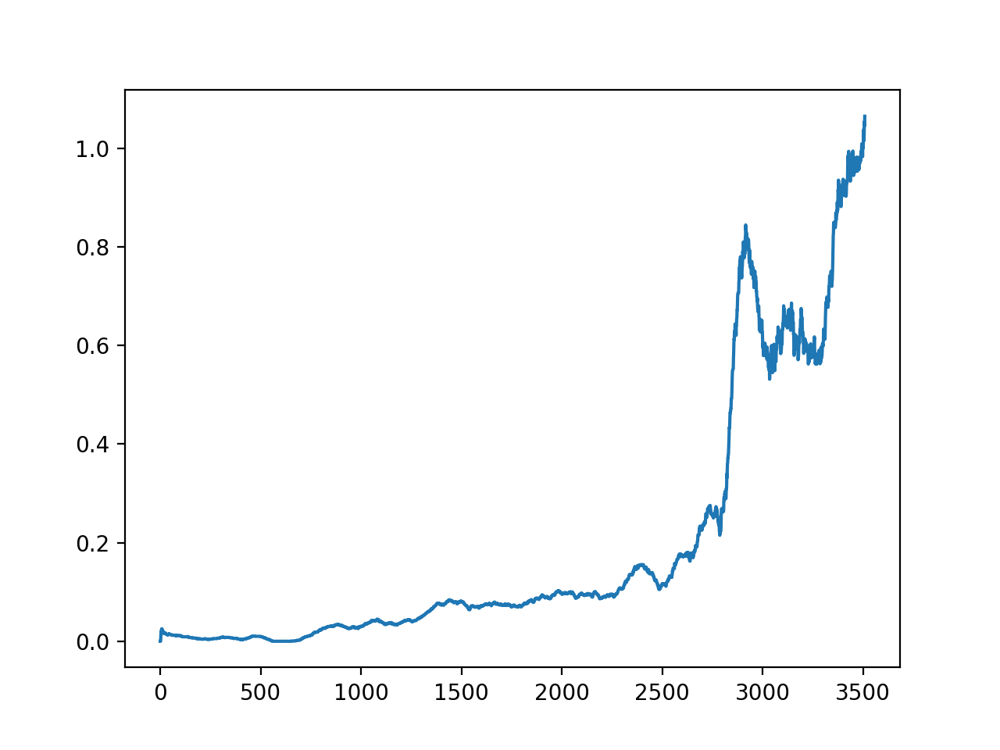
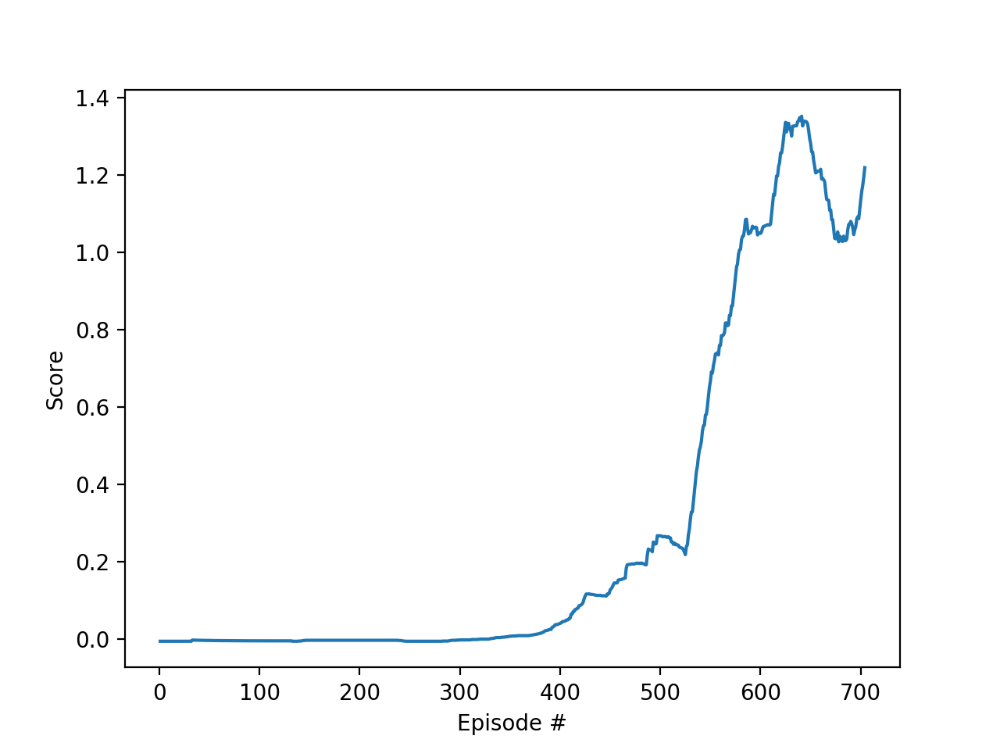

# Environment 

Tennis environment is playground provided by Unity for machine learning challenges. In the simulation there are two agents (tennis rackets) which goal is to strike a ball. The environment is considered to be solved when on average every agent strike at least 10 times in single game (ball do not hit the ground).

#### Reward 
Environment is partially collaborative and partially competitive - as a result every agent can get positive or negative reward.

Every time the ball pass the net, the agent which last strike the ball gets a reward of +0.05. (big positive reward).

When the ball hits the ground the agent on which side it happened gets -0.005 reward (small negative reward).

## Learning Algorithm

To solve Tennis environment I decided to use multi-agent DDPG (MADDPG) algorithm. To reduce code repetition I have implemented the MADDPG on top of the DDPG algorithm, which I implemented to solve Reacher environment.

The neural network models behind my solution are:

#### Critic

Critic consist of:

* Input layer: 33 neurons (agent state)
* 1st hidden layer: 256 neurons fully connected with input layer, and 4 input neurons (action state)
* 2nd hidden layer: 256 neurons 
* 3rd hidden layer: 256 neurons 
* Output layer: 1 neurons

All layers are connected by Relu activation function.

#### Actor

Actor consist of:

* Input layer: 33 neurons (agent state)
* 1st hidden layer: 256 neurons 
* 2nd hidden layer: 256 neurons 
* 3rd hidden layer: 256 neurons 
* Output layer: 4 neurons

The layers are connected by Relu activation function, and output layer has hyperbolic tangent.
    
#### Noise
To challenge exploration vs exploitation problem during learning, I have used random noise with decreasing amplitude over the time. I also tried to use Ornstein-Uhlenbeck noise - but unfortunately it has resulted in unstable learning.

#### Replay Buffer
To break temporary correlation during learning I have decided to use replay memory (RM).

At each step of the environment `(states, actions, rewards, next_states, dones)` tuples are added to the replay buffer. Then the algorithm runs few (`UPDATE_STEPS`) optimization steps for each agent independently.
#### Hyper-parameters
Here are the hyper parameters used for training.

* `UPDATE_STEPS = 3`
* `BUFFER_SIZE = int(1e5)`  (replay buffer size)
* `BATCH_SIZE = 128  `      (minibatch size)
* `GAMMA = 0.99`            (discount factor)
* `TAU = 1e-3`              (for soft update of target parameters)
* `LR_ACTOR = 1e-5`         (learning rate of the actor)
* `LR_CRITIC = 1e-4`        (learning rate of the critic)
* `WEIGHT_DECAY = 0`        (L2 weight decay)

## Plot of Rewards (mean over all agents)

The primary goal of average score +0.5 over all agents (over 100 episodes) has been achieved after 2850 episodes.

The double goal score (+1.0) has been achieved after 3508 episodes.

### Comparison to DDPG
I have tried to solve this environment as only collaborative challenge. Although in most cases it is impossible, in this scenario we care more about duration of the game rather then win of specific agent. 

I used a shared networks for both actors and critics. Moreover I have fully reuse the network structures and hyperparameters from previous environment.
The result was surprisingly good:

 
 
 it has reduced the learning time about 5 times comparing to MADDPG.
 

## Area for implement 
* Try different network architecture to reduce network complexity
* Play with hyper-parameter to reduce learning time 
* Implement support for priorities memory replay.
* Try other types of multi-agent actor-critic RL algorithms.

 